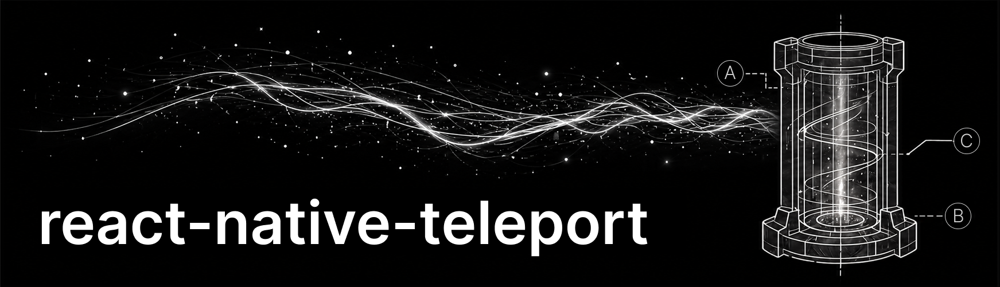

Missing native portal implementation for react-native. Teleport views across your component tree for seamless transitions and powerful UI patterns.

  

### Key features

- 🕳️ Native view teleportation
- ✨ Acts as portal and teleport (aka re-parenting)
- ⚡ Native performance
- 🔓 Escape any layout
- ⚛️ Preserves react context
- 🌲 Keeps react tree continuity
- 🚀 Supports iOS, Android and Web
- 📝 Declarative API
- ✅ No private API usage
- 📦 Zero dependencies
- 💪 Written in TypeScript
- 🧬 Supports new architectures
- 🪞 Mirror support (in future)

### Installation

Check out the [installation](https://kirillzyusko.github.io/react-native-teleport/docs/installation) section of the docs for detailed setup instructions.

### Documentation

Full API reference and guides available at:
[https://kirillzyusko.github.io/react-native-teleport](https://kirillzyusko.github.io/react-native-teleport)

### Contributing

See the [contributing guide](CONTRIBUTING.md) to learn how to contribute to the repository and the development workflow.

### License

MIT
